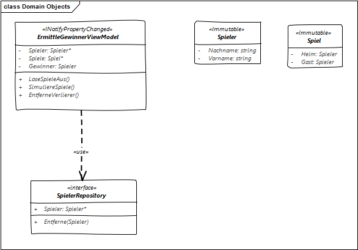

Die hier enthaltene Lösung ist in der Vorbereitung auf das 17. Treffen der Softwerkskammer entstanden. 

# Lösungsidee

Die Lösung basiert auf der Idee, die Logik in verschiedene MVVM-Oberflächen wie WPF, Windows Phone App, Windows Store App oder ähnliches einzubinden.
Von daher wurde ein ViewModel mit der Logik implementiert und in eine Portable Class Library verpackt.

Das folgende Diagramm zeigt einen groben Überblick der entworfenen Klassen 

# Was noch fehlt

* Tests für zufällige Auslosung der Spiele
* Tests für zufällige Auslosung der Gewinner pro Spiel 
* Fertigstellung von DataBinding im ViewModel (INotifyPropertyChanged)
* GUIs für verschiedene Plattformen 